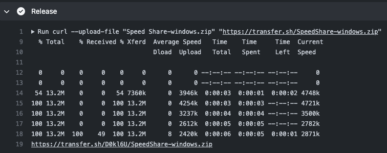

# 速享

Language: 中文简体 | [English](README-EN.md)

 
<!--  -->

       

 

这是一款完全基于局域网的文件互传终端，速享不使用任何服务器，不使用您的移动流量，不收集任何用户数据，完全的点对点传输。

可以快速共享文本消息，图片或其他文件，文件夹。

适用于局域网中的文件互传，解决 QQ，微信等上传文件会经过服务器的问题，或者部分测试手机，没有这类聊天软件。

**这是一个纯个人的开源项目，它虽然不及企业级的一些项目一般完整和强大，但我会耐心的完善以及打磨这个产品。**

**注意！！！**

这个仓库仍在开发维护中，但是由于平时工作缘故，所以不会有太多空闲的时间，相关的截图等都没来得及更新，见谅！！！
编译不过联系 QQ:906262255，注明来意~
## 目录

- [帮助开发](#帮助开发)
- [截图](#截图)
- [下载](#下载)
- [功能列表](#功能列表)
- [局域网发现](#局域网发现)
- [浏览器加入](#浏览器加入)
- [本地文件管理](#本地文件管理)
- [开发者文档](#开发者文档)
- [Q&A](#qa)

## 帮助开发

呜呜呜一个人有点写不动，最近来了一位设计师@柚凛，出了整套速享的设计图，我准备直接将速享版本更新到2.0。

但是产品在整体设计上调整较多，开发量也较大，如果有任何的 Flutter 开发者愿意帮忙开发，联系QQ 906262255，呜呜呜~

## 截图

   

    

## 下载

- [个人服务器下载地址](http://nightmare.fun/YanTool/resources/SpeedShare/?C=N;O=A)

该项目集成了 Github Action 来提供自动打包的功能，然后使用`transfer.sh`进行包的上传，所以你可以在[actions](https://github.com/nightmare-space/speed_share/actions)中找`release`这个 task 能看到下载地址。

 

## 功能列表

- 接收文件分类
- 远程文件管理
- 文件静态部署（类似 tomcat 或者 nginx）。
- 局域网设备发现，快速加入共享。
- 像聊天一样在局域网共享文件，点对点连接，不使用服务器中转。
- 支持图片以及视频消息直接预览（视频预览仅支持 Android 与 Web ），快速缓冲。
- 支持断点续传
- 支持多个设备同时分享与查看
- 文件夹共享
- 浏览器快速加入共享
- 历史消息获取

## 局域网发现
发现其他设备启动速享后，主页顶部会出现提示，如图：

点击√即可加入共享房间~

## 浏览器加入
客户端启动速享后，点击底部导航栏切换到主页，会有一个`远程访问`的卡片，局域网内浏览器打开对应的 url 即可加入共享。

## 文件共享
### 在房间中
点击右下角`+`按钮，可选择来自系统文件管理器的文件、速享内部文件管理器的文件到共享窗口。

### 在主页
点击主页`+`号按钮，也可实现如上分享逻辑。

## 设置
速享开放了一些用户设置，目前有以下设置
- 自动下载
- 剪切板共享
- 收到消息振动提醒
- 下载路径切换

通过底部导航栏切换至`我的`页面即可看见设置功能。

 

## 本地文件管理
切换到文件管理页面，会显示速享的接收文件概览，点击右上角切换箭头，即可切换文件管理详情。
 

<!-- ## 远程文件管理
速享的亮点功能之一，可以远程管理已连接设备的文件，手机端连接到其他设备后，通过底部导航栏可进入远程文件管理器页面。

桌面版视图，点击左边侧栏进入对应的设备聊天窗口，即可远程显示对方设备的文件。
 -->

## 开发者文档

详见 [DEVELOP.md](DEVELOP.md)

