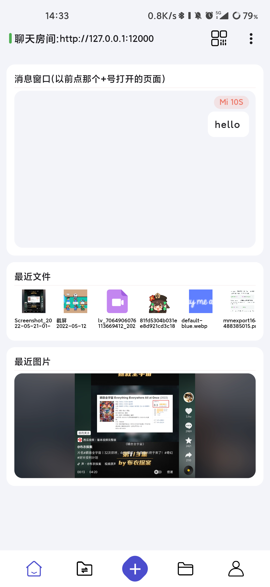
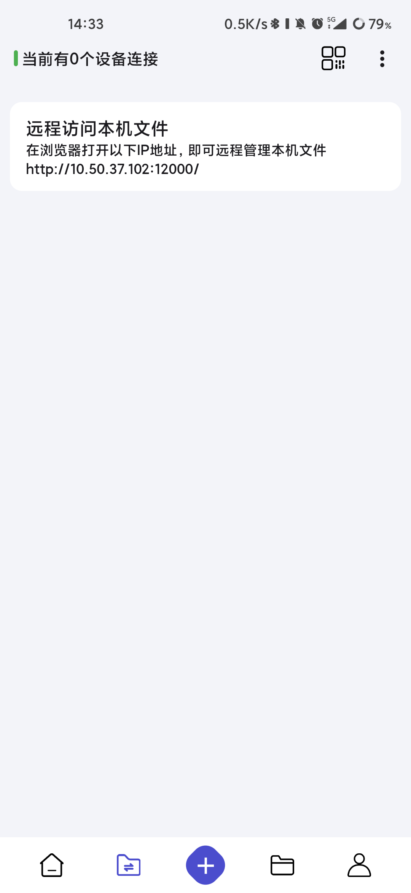
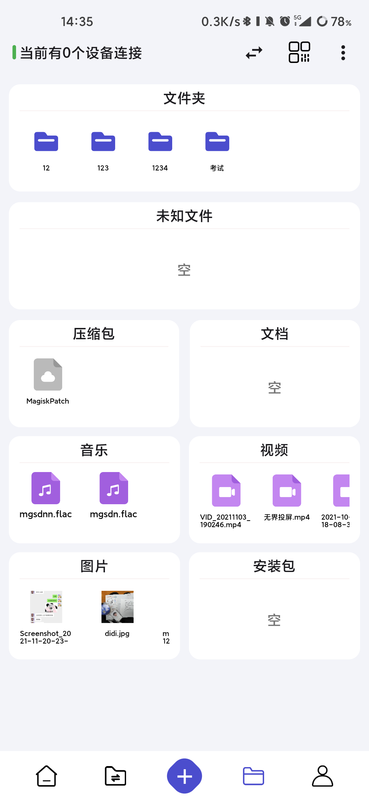
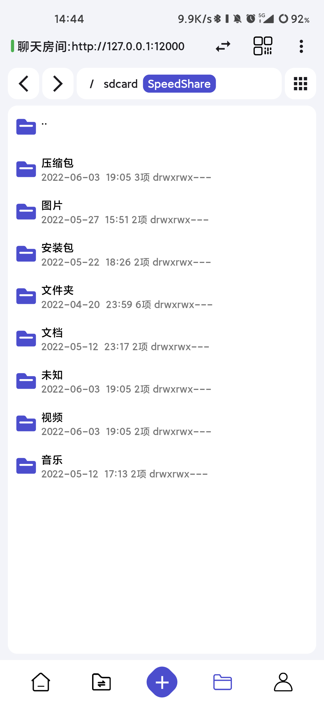
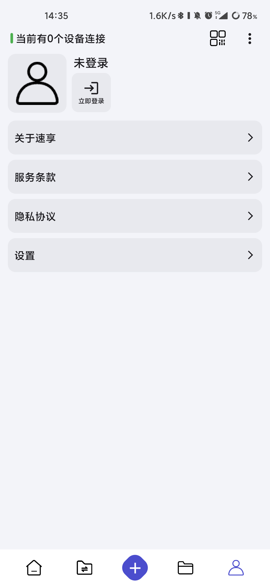
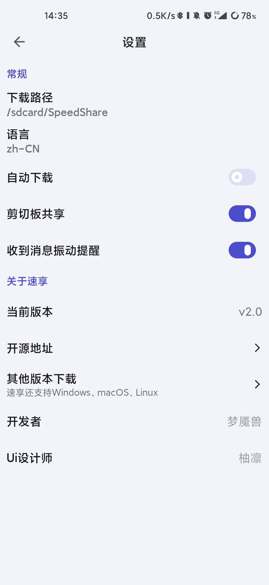
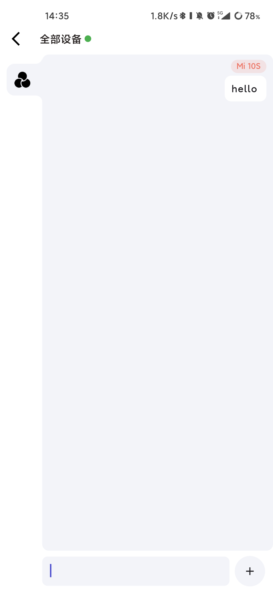

# Speed Share

Language: English | [中文简体](README-ZH.md)

 
<!--  -->

       

- [Speed Share](#speed-share)
  - [Notice](#notice)
  - [Screenshots](#screenshots)
  - [Features](#features)
  - [Developer Documentation](#developer-documentation)

This is a completely LAN-based file transfer terminal. Speed Share does not use any servers, does not consume your mobile data, and does not collect any user data. It enables peer-to-peer transmission.

You can quickly share text messages, images, or other files and folders.

It is suitable for LAN file transfer, solving the problem of files being routed through servers in applications like QQ and WeChat.

## Notice

This repository is still under development and maintenance. However, due to my regular work, I do not have much free time, and I haven't had the opportunity to update related screenshots, etc. I apologize for the inconvenience!

Since I started my full-time job, I no longer have a lot of energy to invest in open-source projects.

If you encounter build issues, please contact me at mengyanshou@gmail.com.

## Screenshots

   

    

## Features

- File Transfer
  - Share files over LAN like chatting
  - Resume interrupted transfers
  - Image preview, fast online video playback
  - Peer-to-peer high-speed downloading, no server relaying
  - Simultaneous sharing and viewing on multiple devices
  - Folder sharing (under reconstruction)
- Remote File Management
  - Visual browsing
  - Delete, rename
- File categorization: Classify received files by extension
- Quick Connections
  - UDP automatic connection
  - Scan QR code to connect
  - Manual input connection
  - Historical connections
- File static deployment: Similar to Tomcat or Nginx, allowing devices to use browsers to view files and access web pages
- Support for browser joining as clients
- Clipboard sharing
- Multi-platform support: Android, Windows, macOS, Linux
- Responsive design: Adapt to various screen sizes, automatic layout adaptation for tablets, smartphones, and landscape/portrait orientation switching
- Support for Android SAF: Can receive files shared by any app
- Background running on desktop

## Developer Documentation

See [DEVELOP.md](docs/DEVELOP.md) for detailed information.
